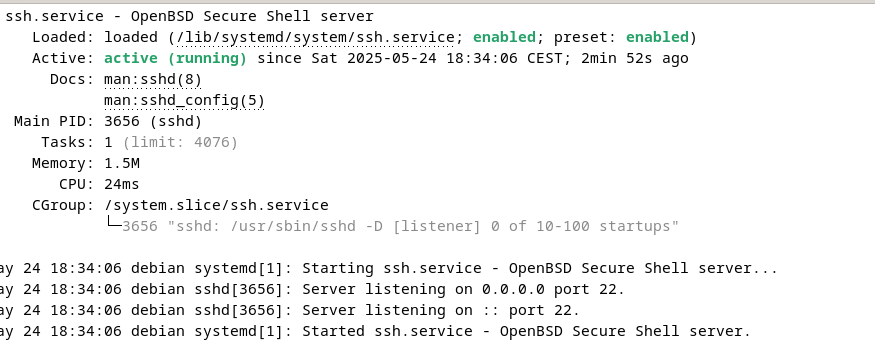
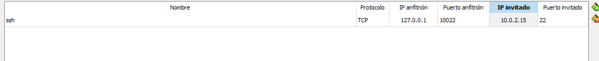
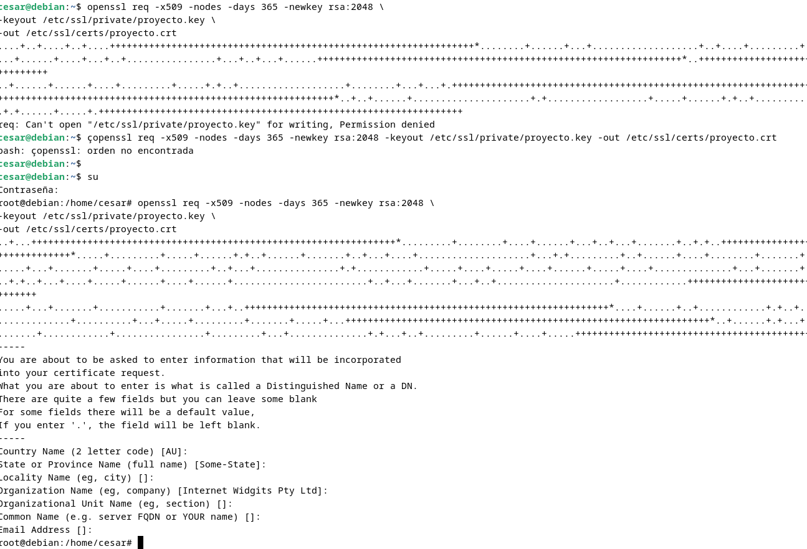
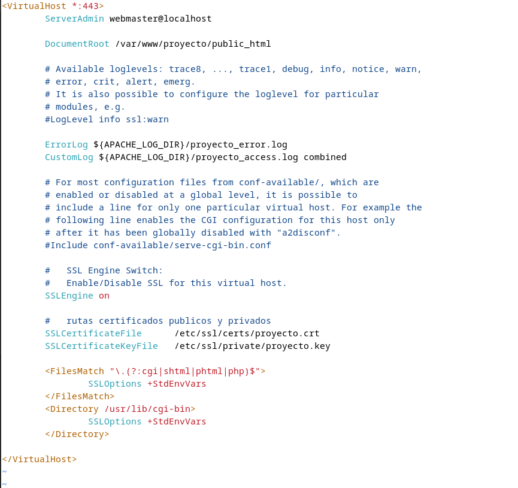
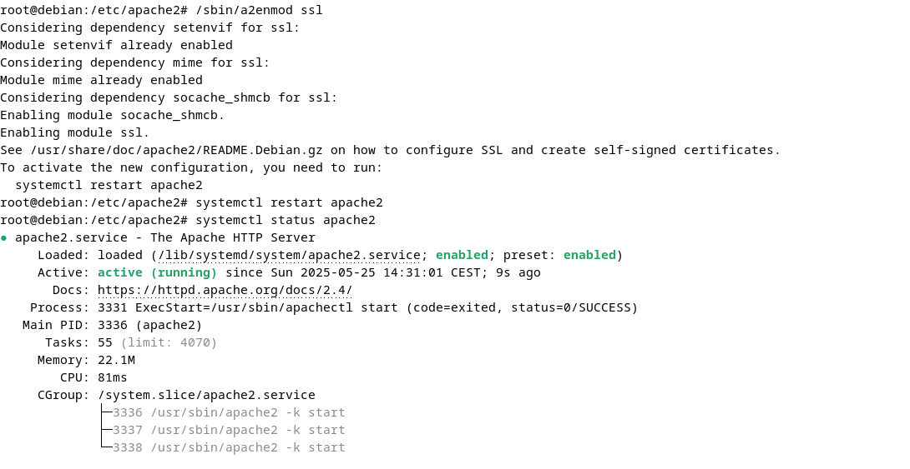
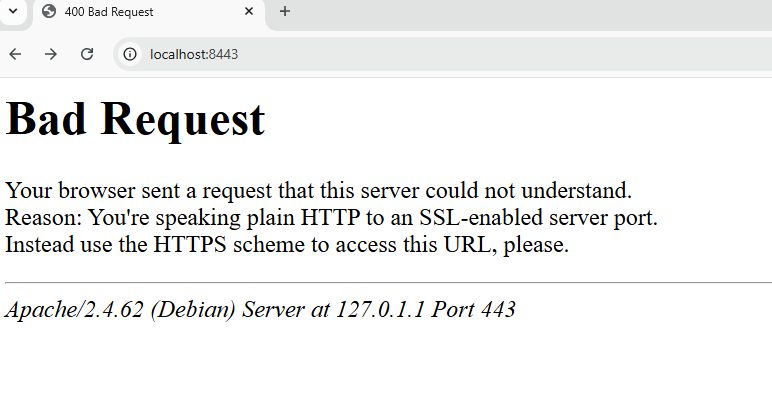
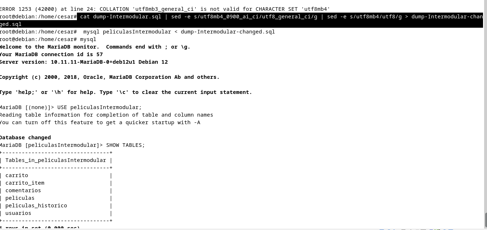
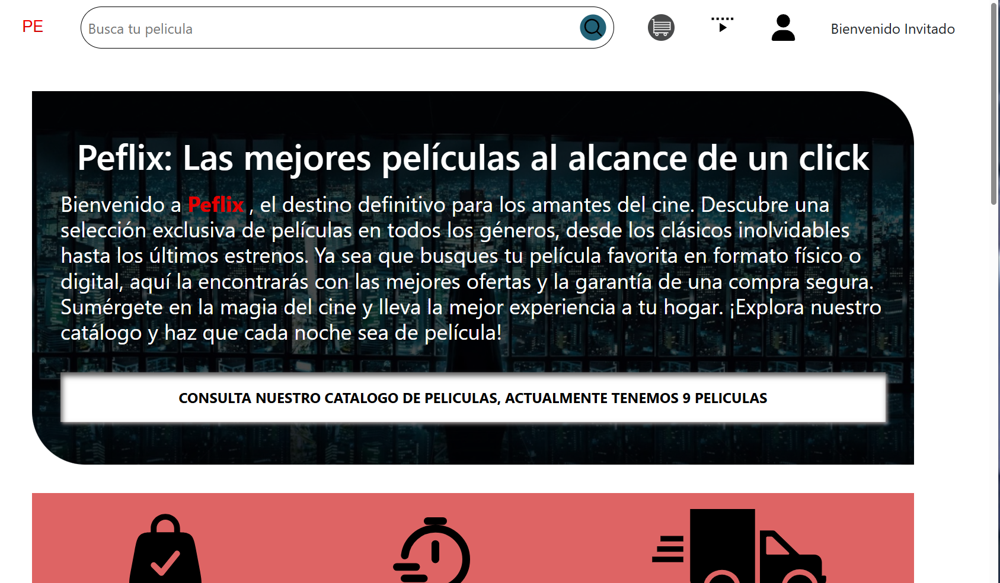

<style>
/* Estilos generales */
section {
  font-family: 'Segoe UI', 'Arial', sans-serif;
  padding: 1.5em;
}

/* Header en la parte superior */
header {
  font-size: 0.9em;
  color: #00ffff;
  text-align: center;
  border-bottom: 1px solid #00ffff;
  padding: 0.3em 0;
  font-weight: bold;
}

/* Footer en la parte inferior */
footer {
  font-size: 0.8em;
  color: #cccccc;
  text-align: center;
  border-top: 1px solid #444;
  padding: 0.3em 0;
  font-style: italic;
}
</style>

# Guía instalación debian

Cesar Garcia

---

## Instalacion de servicio ssh

**Instalamos ssh con el siguente comando**

```bash
apt install openssh-server
```

---

## Instalacion de servicio ssh

Vamos a comprobar el estado del servidor con el siguente comando

```bash
systemctl status ssh
```

---

## Instalacion de servicio ssh



---

### renvio puertos ssh

- nombre ssh

## 

---

### Prueba de conexión SSH anfitrión-invitado

Usamos el siguiente comando para conectarnos a ssh remotamente desde mi windows a debian

```bash
ssh -p 10022 cesar@localhost
```

---

### Prueba de conexión SSH anfitrión-invitado

> Nota: Es recomendable que para conectarse a ssh utilizar una clave ssh para conectarse en vez de autenticarse con usuario y contraseña

---

### Prueba de conexión SSH anfitrión-invitado

## 

---

## Instalación apache2

Instalaremos apache con el siguente comando

```bash
apt install apache2
```

---

### Comprobar status de apache

```bash
systemctl status apache2
```

---

## Status apache2


---

### renvio puertos apache2

## 

Accediendo a el servidor apache desde mi maquina en el puerto 8080

---


---

### Configuracion de apache2

1.  Creacion del sitio de prueba

```bash
mkdir -p /var/www/proyecto/public_html
```

2. Asignacion de permisos al usuario sobre la carpeta

```bash
chown -R $USER:$USER /var/www/proyecto
```

---

### Configuracion de apache2

3.  Creando un html en nuestro sitio

```bash
vim /var/www/proyecto/public_html/index.html
```

4. Copia el archivo del Virtual Host por defecto:

```bash
cd /etc/apache2/sites-available/
cp 000-default.conf proyecto.conf
```

---

### Configuracion de apache2

5. Editar archivo de virtual Host

```bash
vim /etc/apache2/sites-available/proyecto.conf
```

6. Habilitar el nuevo sitio y reiniciar Apache

```bash
/sbin/a2ensite proyecto.conf
systemctl reload apache2
```

---

### Configuracion de apache2

> Nota: En el punto 6 tuve problemas ya que me seguia apareciendo la pagina de apache por defecto esto ocurre porque apache estaba cogiendo la configuracion por defecto del fichero /etc/ apache2/sites-available/proyecto.conf asi que tuve que desactivarlo con el siguiente comando

```bash
/sbin/a2dissite 000-default.conf
```

---

### Configuracion de apache2

Luego reiniciar apache

```bash
systemctl reload apache2
```

---

### Configuracion de apache2

En nuestro puerto 8080 veremos nuestra pagina

## 

---

### Conexión segura con HTTPS

#### Crear un Virtual Host HTTPS

1. instalando el apaquete de opessl para certificados

```bash
apt update && apt install openssl
```

---

### Conexión segura con HTTPS

2. Generar la clave privada y el certificado

```bash
openssl req -x509 -nodes -days 365 -newkey rsa:2048 \
-keyout /etc/ssl/private/proyecto.key \
-out /etc/ssl/certs/proyecto.crt
```

---

### Conexión segura con HTTPS

Nos hará la siguiente salida y nos hará unas preguntas al generar el certificado:

<div style="text-align: center; margin-top: 1em;">
  
</div>

---

### Conexión segura con HTTPS

3. Copia el archivo del Virtual Host HTTP por defecto:

````bash
cd /etc/apache2/sites-available/
cp default-ssl.conf 000-proyecto-ssl.conf


### Conexión segura con HTTPS

```bash
cd /etc/apache2/sites-available/
cp default-ssl.conf 000-proyecto-ssl.conf
````

---

### Conexión segura con HTTPS

4. Editar archivo virtual host https

```bash
vim /etc/apache2/sites-available/000-proyecto-ssl.conf
```

---

### Conexión segura con HTTPS

Vamos a configurar el archivo del Virtual Host HTTPS de esta manera:

---

<div style="text-align: center;">
  
</div>

---

### Conexión segura con HTTPS

5. Habilitemos el sitio y reiniciamos el apache

```bash
/sbin/a2ensite proyecto-ssl.conf
systemctl reload apache2
```

---

### Conexión segura con HTTPS

> Al hacer reload sale el siguente error por pantalla hay que instalar el siguente modulo a2enmod ssl

---

### Conexión segura con HTTPS

Tenemos que ir a esta ruta **/sbin/a2enmod**

Usar este comando **a2enmod ssl** y reiniciar apache
Despues he hacer un status todo funciona correctamente

---

<div style="text-align: center;">
  
</div>

[Solucion mod ssl activar ](https://stackoverflow.com/questions/5257974/how-to-install-mod-ssl-for-apache-httpd)

---

6. Renvio de puertos https


Para acceder a la veb escribimos esta url con el puerto 8443
https://localhost:8443/

---

### Conexión segura con HTTPS

Si entramos por http nos dara el siguente error

<div style="text-align: center;">
  
</div>

---

### Conexión segura con HTTPS

tendremos que acceder con esta direccion y este puerto https://localhost:8443/

---

### Sitios web dinámicos con PHP

1. instalacion y configuracion de php mediante el driver de apache

```bash
apt install php libapache2-mod-php
systemctl restart apache2
```

2. checkear ls instalacion

```bash
php -v
```

---

### Sitios web dinámicos con PHP

este comando nos arrojara esta salida

PHP 8.2.28 (cli) (built: Mar 13 2025 18:21:38) (NTS)
Copyright (c) The PHP Group
Zend Engine v4.2.28, Copyright (c) Zend Technologies
with Zend OPcache v8.2.28, Copyright (c), by Zend Technologies

---

3. Prueba en el sitio web

Añadamos un fichero php a nuestra carpeta raiz del sitio para ver si funciona

```bash
vim /var/www/proyecto/public_html
```

---

### Sitios web dinámicos con PHP

Agregamos este contenido para ver la informacion del servidor php

```php
<?php
phpinfo();
```

---

### Sitios web dinámicos con PHP

4. Comprobar el log de errores aqui apareceran todos los errores del servidor

```bash
tail /var/log/apache2/proyecto_error.log
```

---

## Servidor de base de datos

### introduccion

1. MariaDB es un sistema de gestión de bases de datos relaciona

2. MariaDB utiliza por defecto el puerto 3306

---

#### Instalacion

1. instalacion de mariadb

```bash
apt update
apt install mariadb-server mariadb-client -y
```

2. comprobar estado del servidor

```bash
systemctl status mariadb
```

---

### Servidor de base de datos

3. Transferir el archivo SQL al servidor de destino

Ya tenia un dump realizado asi que lo vamos a copiar a la maquina debian con scp s vierne de ssh

```bash
 scp -P 10022 dump-Intermodular.sql cesar@localhost:/home/cesar/
```

---

## Servidor de base de datos

- Con la opcion -P indicamos el numero de puerto del ssh veamos si se exporto correctamente

## 

---

4. Nos conectamos a mysql con este comando

### Servidor de base de datos

```bash
 mysql -u root
```

5. Creamos la base de datos

```bash
CREATE DATABASE peliculasIntermodular;
```

5.5. Verificar si la base de datos se creo bien

```bash
SHOW DATABASES;
```

---

## Servidor de base de datos

6. Creamos al usuario administrador

```bash
CREATE USER 'peflix_admin'@'%' IDENTIFIED BY 'peflixAdmin!';
```

7. Checkear si el usuario esta creado

```bash
SELECT User FROM mysql.user;
```

---

## Servidor de base de datos

8. inportar dump
   ocurrio un error ya que mysql no es compatible con maria db habia que cambiar 2 parametros

---

## Servidor de base de datos

```bash
 cat dump-Intermodular.sql | sed -e s/utf8mb4_0900_ai_ci/utf8_general_ci/g | sed -e s/utf8mb4/utf8/g > dump-Intermodular-changed.sql
```

---

## Servidor de base de datos

<div style="text-align: center;">
  
</div>

---

8.1. Documentacion
[change params mariaDB](https://stackoverflow.com/questions/3031412/how-to-export-a-mysql-database-using-command-prompt)

9. Damos los permisos

```bash
GRANT ALL PRIVILEGES  ON peliculasIntermodular.* TO 'peflix_admin'@'%';
FLUSH PRIVILEGES;
```

---

### Instalamos el módulo php-mysql

```bash
apt install php-mysql -y
systemctl restart apache2
```

---

## Instalacion GIT

```bash
apt install git
```

1. Configurar usuario y correo

```bash
git config --global user.name "cesargm1"
git config --global user.name "cg.gtav@gmail.com"
```

---

### Instalacion de github cli

```bash
apt install gh
```

---

## Instalacion GIT

**login**

```bash
gh auth login
```

---

Cambiamos el documentRoot de los ficheros

```bash
vim  /etc/apache2/sites-available/proyecto.conf
vim  /etc/apache2/sites-available/proyecto.conf
vim  /etc/apache2/sites-available/000-proyecto-ssl.conf

```

usaremos esta ruta nueva

```bash
var/www/proyecto/public_html/public
```

---

## Instalacion GIT

2. Creamos el .env con usuario y contraseña que creamos


### Instalamos composer

```bash
 apt-get install composer
 composer install
```

---

### resultado final

<div style="text-align: center;">
  
</div>
